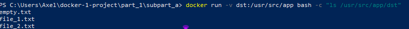

### 1. #### a.


- Bâtir l'image app 
```
docker build -t app .
```  

- création d'un volume
```
docker volume create dst
```

### 1. #### b.
   

- Lancer l'app
```
docker run -e SRC='./src' -e DST='./dst' -v dst:/usr/src/app img_1a
```
### 1. #### c. 
 


- Vérification avec un ls dans le volume "dst" dans le repertoire dst
```
docker run -v dst:/usr/src/app bash -c "ls /usr/src/app/dst"
```



### 2.

- le script n’attende plus après avoir fait la copie.
```
j'ai enlevé le time.sleep(10000)
```

### 3. #### a.


- Build de l'image bash
```
 docker build -t bash .
 ```