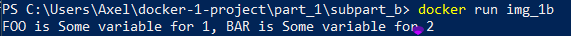
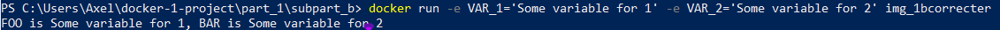

### 1

- La commande pour bâtir l'image

```
docker build -t img_1b . 
```


- La commande pour lancer le conteneur sur la base de l'image

```
docker run img_1b 
```
### 2

```
VAR_1
```
- a cette valeur ( Some variable for 1 ) car il lui ai attribué un variable d'environnement

```
VAR_2
```
- a cette valeur ( vide ) car il n'a pas de variable d'environnement

- J'ai corrigé et supprimer pour avoir ce résultat :

```Dockerfile

FROM busybox

ENV VAR_1="Some variable for 1"

ENV VAR_2="Some variable for 2"

RUN export VAR_2="Some variable for 2"

CMD echo FOO is $VAR_1, BAR is $VAR_2
```




- J'ai donc enlever les variables d'environnement dans le Dockerfile-corrected :
```Dockerfile

FROM busybox

RUN export VAR_2="Some variable for 2"

CMD 

- puis j ai run avec les variables d environnements
```
docker run -e VAR_1='Some variable for 1' -e VAR_2='Some variable for 2' img_1bcorrecter
```



3:
Voici à quoi ressemble le "Dockerfile-corrected" :
```Dockerfile
FROM busybox

CMD echo FOO is $VAR_1, BAR is $VAR_2
``` 

Voici la commande à utiliser pour définir les variables d'environnement à travers le docker run :
```bash
docker run -e VAR_1="Some variable for 1" -e VAR_2="Some variable for 2" img_1bcorrected
```

# Résultat : 
FOO is Some variable for 1, BAR is Some variable for 2

4:
```bash
[+] Building 1.2s (7/7) FINISHED
 => [app internal] load build definition from Dockerfile                                                                                                                    0.0s
 => => transferring dockerfile: 319B                                                                                                                                        0.0s
 => [app internal] load .dockerignore                                                                                                                                       0.0s
 => => transferring context: 2B                                                                                                                                             0.0s
 => [app internal] load metadata for docker.io/library/busybox:latest                                                                                                       0.0s
 => CACHED [app 1/3] FROM docker.io/library/busybox                                                                                                                         0.0s
 => [app 2/3] RUN export VAR_1                                                                                                                                              0.4s
 => [app 3/3] RUN export VAR_2                                                                                                                                              0.5s
 => [app] exporting to image                                                                                                                                                0.1s
 => => exporting layers                                                                                                                                                     0.1s
 => => writing image sha256:9ed503fd6dd3b6693d75940bdc1f2639bc0ca72629e043242c5343f049820ec3                                                                                0.0s
 => => naming to docker.io/library/busybox                                                                                                                                  0.0s
[+] Running 1/1
 ✔ Container subpart_b-app-1  Created                                                                                                                                       0.1s
Attaching to subpart_b-app-1
subpart_b-app-1  | FOO is Some variable for 1, BAR is Some variable for 2
subpart_b-app-1 exited with code 0
```

# On voit bien que la commande echo est executée avec les bonnes variables environnementales.