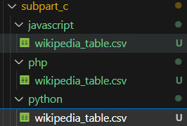
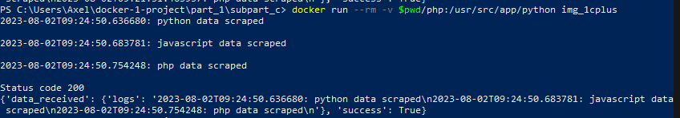
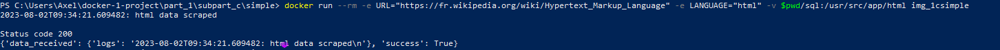
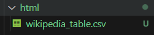
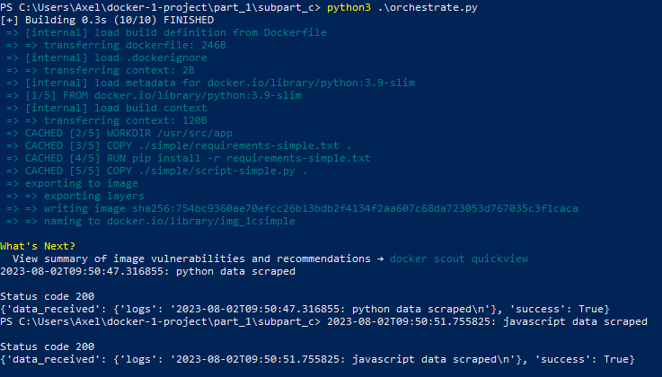

### 1.

- Explication du fichier "script.py".

```python
import datetime
import os
from urllib import request, parse
import ssl

import requests
import pandas as pd

# Le 1er bloc définie la variable urls qui correspont à 2 sites wikipedia (python et javascript)
urls = {
    "python": "https://fr.wikipedia.org/wiki/Python_(langage)",
    "javascript": "https://fr.wikipedia.org/wiki/JavaScript",
}

# Le 2ème bloc est une fonction(get_table) qui permet de récupérer une table grâce au module request et de mettre en forme le tableau avec pandas
def get_table(url):
    context = ssl._create_unverified_context()
    response = request.urlopen(url, context=context)
    html = response.read()
    return pd.read_html(html)[0].iloc[1:-1, 0:2].dropna()

# Le 3ème bloc va parcourir les urls créer un dossier language si il n'existe pas, créer une table avec les urls puis transformer cette table en fichier csv et nommer le fichier csv en fonction du language.
# Ensuite il va ouvrir un fichier "logs.txt" en mode "append", récupérer la date actuelle en format "YYYY-MM-DD" puis va définir du texte dans le fichier de logs au format : "date actuelle: language data scrapped" Puis il va afficher le message et l'écrire dans le fichier de logs.
if __name__ == "__main__":
    for language, url in urls.items():
        os.makedirs(language, exist_ok=True)
        table = get_table(url)
        table.to_csv(f"{language}/wikipedia_table.csv")

        with open("logs.txt", "a") as f:
            now = datetime.datetime.now().isoformat()
            message = f"{now}: {language} data scraped\n"
            print(message)
            f.write(message)

    ############################# question 4

    URL_LOGS = "????"

    with open("logs.txt", "r") as f:
        try:
            response = requests.post(URL_LOGS, json={"logs": f.read()})

            print("Status code", response.status_code)
            print(response.json())

        except Exception as e:
            print(e)
```

### 2.
#### a.

- L'image s'appel bien img_1c
#### b.

- L'image se supprime bien avec l'option --rm
#### c.

- Il y a bien 2 volumes, 1 pour py et 1 pour js

- Les commandes à executer pour répondre à toute la question 2

```bash
docker build -t img_1c .
docker run --rm -v $pwd/python:/usr/src/app/python img_1c
docker run --rm -v $pwd/javascript:/usr/src/app/javascript img_1c 
```

#### 3.

- J'ai choisi de rajouter PHP pour faire LE trio de language de programmation, comme les oiseaux légendaires Pokemon

- Dans le script python.py je rajoute dans les urls :

```python
urls = {
    "python": "https://fr.wikipedia.org/wiki/Python_(langage)",
    "javascript": "https://fr.wikipedia.org/wiki/JavaScript",
    "php": "https://fr.wikipedia.org/wiki/PHP",
}
```

- Je rebâtit l'image mais cette fois sous les nom "img_1cplus" puis je rajoute le docker run pour notre nouveau language "PHP"

```bash
docker build -t imc_1cplus .
docker run --rm -v $pwd/python:/usr/src/app/python img_1cplus
docker run --rm -v $pwd/javascript:/usr/src/app/javascript img_1cplus
docker run --rm -v $pwd/php:/usr/src/app/php img_1cplus 
```




#### 4.

- Eplication du code en dessous de "qestion 4" dans le script.py :
- ça va effectuer une requête post sur une l'url définie dans la variable URL_LOGS puis va lire le fichier de log

```python
URL_LOGS = "????"

with open("logs.txt", "r") as f:
    try:
        response = requests.post(URL_LOGS, json={"logs": f.read()})
        print("Status code", response.status_code)
        print(response.json())

    except Exception as e:
        print(e)
```

• Création d'un dossier "pre-project" avec les fichiers "Dockerfile-app" "requirements-app.txt et "app.py"

• Modification du fichier "script.py" 
```python
URL_LOGS = "http://host.docker.internal:80/get_request" ### URL qui permettra d'accéder a notre app qui répond seulement à des requêtes "POST".
```
et build des images "img_1capp" et "img_1cplus"

• Je run d'abord "img_1capp" puis "img_1cplus

```bash
docker run -p 80:80 img_1capp
docker run --rm -v $pwd/php:/usr/src/app/python img_1cplus
```



#### 5.

• Création d'un dossier "simple" avec les fichiers "Dockerfile-simple.txt" "requirements-simple.txt et "script_simple.py"

• J'ai laissé mon img_1capp en run donc je peux directement commencé sans le run

```bash
docker build -t img_1csimple .
```
```bash
docker run --rm -e URL="https://fr.wikipedia.org/wiki/Hypertext_Markup_Language" -e LANGUAGE="html" -v $pwd/sql:/usr/src/app/html img_1csimple
```





#### 6.

- Pour ce script j'utilise "subprocess" pour executer des commandes bash via un script python

```python
import subprocess;
import time;

process=subprocess.Popen(["powershell",'docker build -f .\simple\Dockerfile -t img_1csimple .'])
time.sleep(2)
process=subprocess.Popen(["powershell",f'docker run --rm -e URL="https://fr.wikipedia.org/wiki/Python_(langage)" -e LANGUAGE="python" -v $pwd/python:/usr/src/app/python img_1csimple'])
time.sleep(2)
process=subprocess.Popen(["powershell",f'docker run --rm -e URL="https://fr.wikipedia.org/wiki/JavaScript" -e LANGUAGE="javascript" -v $pwd/javascript:/usr/src/app/javascript img_1csimple'])
```

