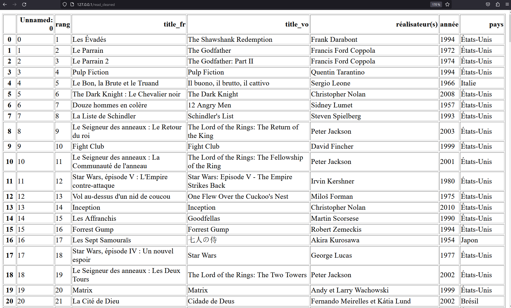

### 1.

- Je créer donc mon "Dockerfile", un fichier "process_data.py" un "app.py" et un "requirements.txt"

- Je doit donc pour exectuer mes 2 scripts.py, créer un script.sh qui les lances, c'est le Dockerfile qui lance ce script.sh

```bash
docker build -t img_d
```

```bash
docker run -p 80:80 -v $pwd`:/usr/src/app img_d
```

