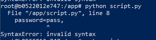

### 4.

- je  supprime donc le docker-compose.yaml et je créer 2 Dockerfile, 1 pour l'app et 1 pour la db. Dans l'ordre j'execute ces commandes :

```bash
docker build -t mongo:latest -f .\Dockerfile-db .
```

```bash
docker build -t app -f .\Dockerfile-app .
```

```bash
docker run -p 27017:27017 -v $pwd/db:/usr/src/db/python mongo
```

```bash
docker run -p 5000:5000 -v $pwd/app:/usr/src/app/python app
```

### 5.

- "b0522012e747" est mon contenair ID

```bash
docker exec -it b0522012e747 bash
```

- J'ai ensuite créer un fichier script.py

```bash
touch script.py
```

- Puis j'ai echo le code dans ce script 

```bash
echo "import pymongo
from pymongo import MongoClient

client = MongoClient(
        host="test_mongodb",
        port=27017,
        username="root",
        password="pass",
        authSource="admin",
    )
db = client["animal_db"]
db = get_db()
_animals = db.animal_tb.find()
print(list(_animals))" > script.py
```

```bash
python script.py
```

- il me donne un synthax error 



- Sinon je me suis mit dans une console python puis j'ai coller le code dans cette console, là aussi j'ai eu une erreur.
- Voici l'output :

```bash
Traceback (most recent call last):
  File "<stdin>", line 1, in <module>
  File "/usr/local/lib/python3.9/site-packages/pymongo/cursor.py", line 1251, in next
    if len(self.__data) or self._refresh():
  File "/usr/local/lib/python3.9/site-packages/pymongo/cursor.py", line 1142, in _refresh
    self.__session = self.__collection.database.client._ensure_session()
  File "/usr/local/lib/python3.9/site-packages/pymongo/mongo_client.py", line 1758, in _ensure_session
    return self.__start_session(True, causal_consistency=False)
  File "/usr/local/lib/python3.9/site-packages/pymongo/mongo_client.py", line 1703, in __start_session
    self._topology._check_implicit_session_support()
  File "/usr/local/lib/python3.9/site-packages/pymongo/topology.py", line 538, in _check_implicit_session_support
    self._check_session_support()
  File "/usr/local/lib/python3.9/site-packages/pymongo/topology.py", line 554, in _check_session_support
    self._select_servers_loop(
  File "/usr/local/lib/python3.9/site-packages/pymongo/topology.py", line 238, in _select_servers_loop
    raise ServerSelectionTimeoutError(
pymongo.errors.ServerSelectionTimeoutError: test_mongodb:27017: [Errno -2] Name or service not known, Timeout: 30s, Topology Description: <TopologyDescription id: 64cb727a8cee9def05ce4da4, topology_type: Unknown, servers: [<ServerDescription ('test_mongodb', 27017) server_type: Unknown, rtt: None, error=AutoReconnect('test_mongodb:27017: [Errno -2] Name or service not known')>]>
```

- Explication des clés des dictionnaires

```python
import pymongo
from pymongo import MongoClient

client = MongoClient(
        host="test_mongodb",
        port=27017,
        username="root",
        password="pass",
        authSource="admin",
    )
db = client["animal_db"]
db = get_db()
_animals = db.animal_tb.find()
print(list(_animals))
```